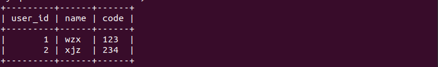
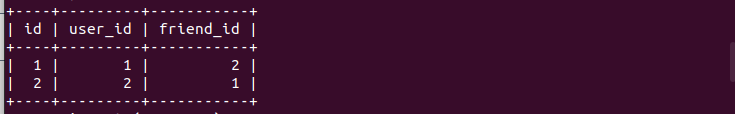
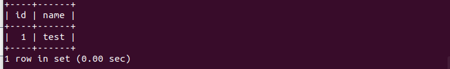
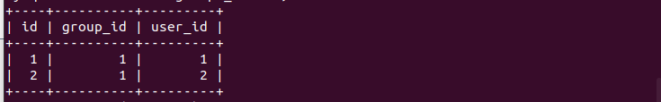
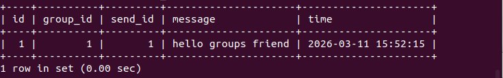

# 接口说明
```python
def register(name,code)
```
用于注册用户
- name为注册用户的用户名（str）
- code为用户密码（str）
```python
def log_in(name,code,ip)
```
用于用户登录
- name为用户名（str）
- code为用户密码（str）
- ip用户地址（str）
```python
def add_friend(user_name,friend_name):
```
用于添加好友
- user_name为用户名
- friend_name为好友名
```python
def create_group(group_name,owner_name):
```
用于创建群聊
- group_name为群聊名称
- owner_name为创建者名称
```python
def add_group_member(group_name,new_name):
```
用于为群聊添加新用户
- group_name为群聊名称
- new_name为新成员名称
```python
def find_ip(name):
```
用于查找用户ip
- name为用户名称
```python
def find_group_ip(name):
```
用于查找群聊所有人ip
- name为群聊名称
***
#数据库构造
### 示例代码
```python
from   data.data import *

if __name__ == '__main__':
    register("wzx","123")
    register("xjz",234)
    log_in("wzx","123","127.0.0.1")
    log_in("xjz","234","127.0.0.1")
    add_friend("wzx","xjz")
    create_group("test","wzx")
    add_group_member("test","xjz")
    save_message("wzx","xjz","hello!")
    save_group_message("wzx","test","hello groups friend")

```
### 运行结果与数据库构造展示
users数据表

user_sessions数据表

friends数据表

groups_list数据表

groups_member数据表

message数据表

group_messages数据表



### 客户端消息发送请求
```python
'''
Message类表示一条消息，包含发送者信息、内容、时间等属性，如下所示
sender_uid: str       # 发送者的用户ID，字符串类型
sender_nickname: str  # 发送者的昵称，字符串类型
content: str         # 消息内容，字符串类型
time: str            # 消息发送时间，字符串类型，格式由服务器决定
is_self: bool        # 是否是自己发的消息，布尔类型
'''
dict(
    sender_uid=d["sender_uid"],
    sender_nickname=d["sender_nickname"],
    content=d["content"],
    time=d["time"],
    is_self=d["is_self"],
)
```
客户端向服务端发送的消息格式如上所示，实际上是Message类，但是传输的时候


### 服务端向客户端发送群组好友消息
```python 
'''
Contact类表示一条消息，包含发送者信息、内容、时间等属性，如下所示
sender_uid: str       # 发送者的用户ID，字符串类型
sender_nickname: str  # 发送者的昵称，字符串类型
content: str         # 消息内容，字符串类型
time: str            # 消息发送时间，字符串类型，格式由服务器决定
is_self: bool        # 是否是自己发的消息，布尔类型
'''
dict(
    id=d['id'],
    name=d['name'],
    is_group=d['is_group'],
    last_message=d['last_message'],
    last_time=d['last_time'],
    unread=d['unread']
)
```